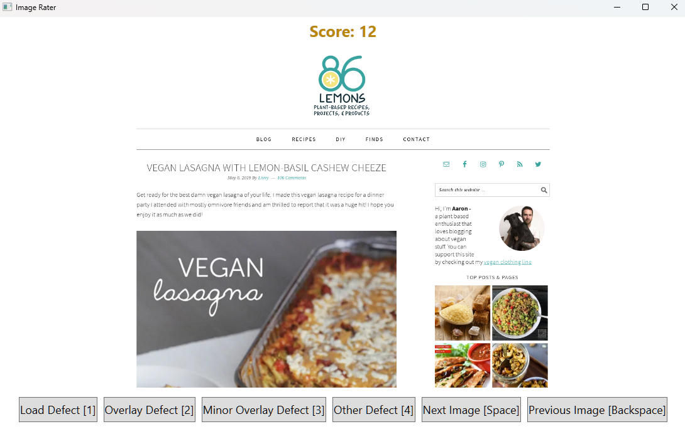

# ImageRater

The Image Rater is a simple desktop application that allows users to annotate a set of images stored in a local folder. The tool displays each image in the folder one by one, allowing the user to annotate it using four buttons: "Load Defect", "Overlay Defect", "Minor Overlay Defect", "Other Defect". Images can also be skipped if there is no annotation needed and the last annotation can be undone if an error was made.

As the user annotates each image, the tool saves the filename and annotation as a new line in a CSV file located in the same folder as the images. This makes it easy for the user to keep track of which images contain defects and enables further analysis of the data using other tools.

It is written in C# using the Windows Presentation Foundation (WPF) framework and can be easily customized and extended to fit specific use cases.

